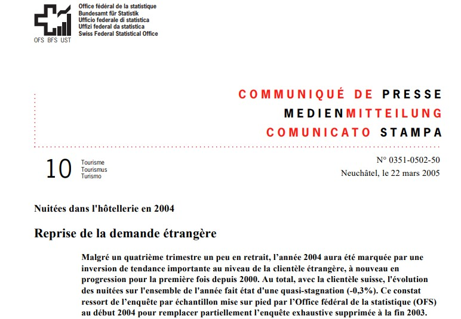
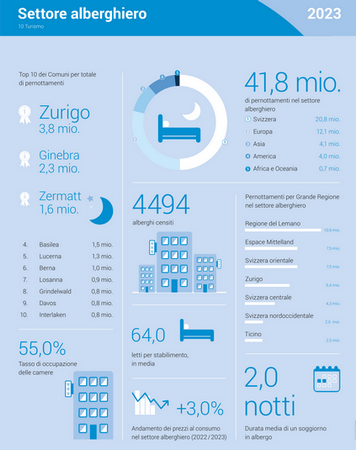
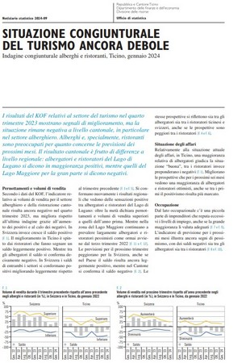

```{r setup, include=FALSE}
rm(list=ls())

options(htmltools.dir.version = FALSE)

knitr::opts_chunk$set(fig.width=5.4, fig.height=2.8, fig.retina=3,
                      message=FALSE, warning=FALSE, cache = TRUE, 
                      autodep = TRUE, hiline=TRUE,
                      dev = "svg"
                      )

options(knitr.kable.NA = '')

```

class: title-slide clear


# **Qualità e reperibilità dei dati statistici**
## *Pochi, tanti o troppi dati?*

<br>

<br>

### Eric Stephani (Ustat)
### .gray40[.font80[*I° sessione appr. lavori di diploma, Castelgrande Bellinzona, 7 novembre 2024*]]

---

# Statistica e turismo

.pull-left[
##### Parlare, riflettere di turismo coi dati? 

 
]

--

.pull-right[
##### Sì, si può fare. Ma come?

.font70[
*Chi dà i numeri? Che numeri sono, dove li trovo?*

]

*- * Statistica pubblica  
*- * Altre statistiche  
*- * "Conclusioni"  

]

---

class: inverse middle center hide-logo

# HESTA e PASTA

---

# **Statistica del turismo, in Svizzera | ** Breve cronistoria


.pull-left[
.font70[
**1848** La statistica pubblica viene inserita tra i compiti del neo-nato Stato federale, in particolare del Dipartimento dell'interno guidato da Stefano Franscini.
<br>

**1850** Primo censimento della popolazione federale.
<br>

**1851** Prime discussioni per introdurre delle indagini per conoscere il numero di turisti nell'alta stagione.
<br>

**1860** Istituzione dell'Ufficio federale di statistica.
<br>

.hl[**1934** ]Introduzione di una statistica nazionale del turismo estesa a tutte le imprese alberghiere.
<br>

.hl[**2003** ] Per questioni di risparmio si decide di interrompere la statistica del turismo.

]
]

--

.pull-right[

]

--

.font80[
.hl[**2005**] --> Reintroduzione di una statistica esaustiva delle ricettività turistica (Hesta).
]

--

.font80[
**2016** --> Reintroduzione di una statistica del settore paralberghiero (Pasta).
]

---

# **Hesta |** La statistica della ricettività statistica

.pull-left[
### 1. Conoscere la fonte
.font90[
*-* Qual è lo scopo della statistica?  
*-* Chi partecipa? Come sono raccolti i dati?  
*-* Quali variabili sono a disposizione?  
*-* Con quale frequenza e con che cadenza?  
*-* Grado di regionalizzazione?
]
]

--

.pull-right[
### Dove si cercano le risposte?
.font90[
##### Prodima 10: TURISMO  
[www.**bfs**.admin.ch](https://www.bfs.admin.ch)  --> *statistiche*    
[www.ti.ch/**ustat**](http://www.ti.ch/ustat)  --> *temi*  

]
]

---

# **Hesta |** La statistica della ricettività statistica

.pull-left[
### 2. I dati, in diverse forme
.font90[
*-* Comunicati stampa  
*-* Approfondimenti ricorrenti    
*-* Tabelle classiche  
*-* .hl[Cubi] di dati

]
]

--

.pull-right[
### Dove si trovano?
.font70[
##### Prodima 10: TURISMO  
[www.bfs.admin.ch](https://www.bfs.admin.ch/bfs/it/home/statistiken/tourismus.html)  
[www.ti.ch/ustat](https://www3.ti.ch/DFE/DR/USTAT/index.php?fuseaction=temi.tema&proId=47&p1=48)  

]

.font90[
[www.**pxweb**.bfs.admin.ch](https://www.pxweb.bfs.admin.ch)

]
]

---

# **Esempio: Risultati Hesta** | 2023 

.pull-left[

.img-left[ ]

.font40[
*Fonte: Infografica UST*, [www.bfs.admin.ch/bfs/it/home/statistiche/turismo](https://www.bfs.admin.ch/bfs/it/home/statistiche/turismo/ricettivita-turistica.assetdetail.30865365.html)

]
]

--

.pull-right[


.font90[
#### Elementi interessanti  
*- * .white[.]  
*- * .white[.]    
*- * .white[.]    

<br>

#### Elementi .hl[mancanti]  
*- * .white[.]  
*- * .white[.]    
*- * .white[.]    

]
]

---

# **Pasta |** La statistica del settore paralberghiero

.left-column[
.font80[
##### Domande
]

.font70[
.gray20[
1. .hl[Scopo] della statistica?  
2. .hl[Chi] partecipa? .hl[Come] sono raccolti i dati?  
3. .hl[Variabili] a disposizione?  
4. Con quale .hl[frequenza]?  
5. Grado di .hl[regionalizzazione]?

]
]
]

--

.right-column[
.font80[
##### Risposte

1. **Completare** i dati Hesta coi dati del paralberghiero  
2. Partecipano: campeggi, ostelli e appartamenti privati. I dati provengono in parte dall'Hesta (camping e ostelli), in parte sono campionari  
3. Dati sull'offerta (numero strutture e posti letto), dati sulla domanda (arrivi, pernottamenti e provenienza degli ospiti)  
4. Ogni tre mesi sono diffusi i dati nazionali, aggregati per trimestre  
5. Una volta all'anno sono diffusi i dati annuali regionali (Grande regione)

]
]


---

class: inverse middle center hide-logo

# Altre fonti?

---

# Inchieste congiunturali KOF

.left-column[
.font80[
##### Domande
]

.font70[
.gray20[
1. .hl[Scopo] della statistica?  
2. .hl[Chi] partecipa? .hl[Come] sono raccolti i dati?  
3. .hl[Variabili] a disposizione?  
4. Con quale .hl[frequenza]?  
5. Grado di .hl[regionalizzazione]?

]
]
]

--

.right-column[
.font80[
##### Risposte

1. Completare i dati di statistica pubblica con informazione di carattere qualitativo
2. Indagine campionaria condotta presso alberghi e ristoranti. In Ticino sono intervistate ca. 100 imprese (50 alberghi e 50 ristoranti) 
3. Dati puramente qualitativi: valutazione della situazione degli affari, prospettive a tre e sei mesi; dati più quantitativi: variazione della cifra d'affari, variazione dei livelli d'impiego  
4. Alcuni dati vengono raccolti mensilmente, altri ogni tre mesi. Diffusione ogni tre mesi  
5. Svizzera e Ticino (alcuni dati anche per sub-regione)    

]

<br>

.font60[
[kof.ethz.ch](https://kof.ethz.ch/it/) *>* **Inchieste** *>* ''Inchiesta congiunturale ristorazione alberghiero''

]
]

---

# Esempio 1: Andamento degli affari

### La questione della .hl[soggettività]

.pull-left[
.font80[

*Valutiamo complessivamente i nostri attuali **affari** *     

... buoni  
... soddisfacenti  
... mediocri  

]

<br>

```{css, echo=F}
    /* Table width = 90% max-width */

    .remark-slide table{
        width: 90%;
    }

    /* Change the background color to white for shaded rows (even rows) */

    .remark-slide thead, .remark-slide tr:nth-child(2n) {
        background-color: white;
    }
```


```{r, echo=F}
source("01_creaTab.R", encoding = "UTF-8")
tab1
```

]

--

.pull-right[

```{r, echo=F}
source("02_creaFig.R", encoding = "UTF-8")
lista_figure_ggu[[1]]
```

```{r, echo=F}
lista_figure_ggu[[2]]
```

]


---

# Esempio 2: Evoluzione della cifra d'affari

### Indicatori soggettivi e .hl[oggettivi]

.pull-left[
.font80[

*La **cifra d'affari** totale in franchi negli ultimi 3 mesi è risultata, rispetto agli stessi mesi dell'anno precedente*     

... superiore ... uguale ... inferiore  

.hl[di circa il ...  %]

]

<br>

```{css, echo=F}
    /* Table width = 90% max-width */

    .remark-slide table{
        width: 90%;
    }

    /* Change the background color to white for shaded rows (even rows) */

    .remark-slide thead, .remark-slide tr:nth-child(2n) {
        background-color: white;
    }
```

```{r, echo=F}
source("01_creaTab_CA.R", encoding = "UTF-8")
tab1
```

]

--

.pull-right[

```{r, echo=F}
lista_figure_ggu[[3]]
```

```{r, echo=F}
lista_figure_ggu[[4]]
```

]

---

# **Risultati KOF** | Gennaio 2024

.pull-left[

.img-left[ ]

]

--

.pull-right[

.font60[
*Fonte: Situazione congiunturale del turismo ancora debole, Ustat*  
[www.ti.ch/ustat](https://www4.ti.ch/dfe/dr/ustat/ufficio/) *>* **NEWS** *>* 10 Turismo

]


.font90[
#### Elementi interessanti  
*- * .white[.]  
*- * .white[.]    
*- * .white[.]    

<br>

#### Elementi .hl[mancanti]  
*- * .white[.]  
*- * .white[.]    
*- * .white[.]    

]
]

---

# Conclusioni: di dati ce ne sono... quindi

.pull-left[
##### .hl[**Come**] possiamo parlare, riflettere di turismo coi dati?

 
]

--

.pull-right[
##### Prossimi passi
.font80[
*- * Come interpretare i dati statistici  
*- * Come confrontarsi ad altri dati statistici, ad esempio alla piattaforma HBenchmark

]

##### Imparare anche a essere critici

.font70[
*Chi usa i dati turistici? Come sono usati?*
]

.font80[
*- * da enti e uffici pubblici  
*- * da alberghi, ristoranti e associazioni di categoria  
*- * dai centri di ricerca

]
]

--

 


---


class: title-slide-fin clear hide-logo


# Ulteriori informazioni

.pull-right2[
.font80[
.white[ ]  
Eric Stephani  
[eric.stephani@ti.ch](mailto:eric.stephani@ti.ch)  


.font70[
.white[ ]  
Repubblica e Canton Ticino  
Divisione delle risorse  
**Ufficio di statistica**  
[www.ti.ch/ustat](http://www.ti.ch/ustat)
]

.font40[
.gray[
Immagini: *TiPress, 2021 - Alessandro Crinari*
]]

]
]
